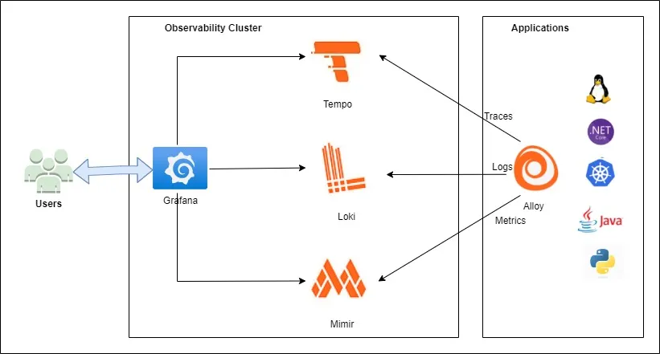

```bash
# 📈 Monitoring Stack with Prometheus, Grafana-Alloy, Grafana Mimir & Loki

[](https://github.com/prometheus-community/helm-charts)
[](https://prometheus.io/)
[](https://grafana.com/)
[](https://grafana.com/oss/loki/)
[](https://grafana.com/docs/alloy)

> Helm chart source: [prometheus-community/helm-charts](https://github.com/prometheus-community/helm-charts)
```
---

---

## 📚 Table of Contents

- [Add / Update Helm Repo for Prometheus](#-add--update-helm-repo-for-prometheus)
- [Install Prometheus Node Exporter](#-install-prometheus-node-exporter)
- [Check Prometheus Pods](#-check-if-prometheus-pods-are-running)
- [Prometheus Configuration](#-prometheus-configuration-prometheusyml)
- [Install Grafana Mimir](#-install-grafana-mimir-using-helm)
- [Install Grafana](#-install-grafana)
- [Upgrade / Uninstall Grafana](#upgrade-grafana-with-custom-values)
- [Install Grafana Alloy](#-install-grafana-alloy)
- [Install Grafana Loki](#-installing-grafana-loki)
- [Alloy Configuration](#-alloy-configuration-example-configalloy)
- [Create Alloy ConfigMap](#-create-configmap-for-alloy)
- [Modify Helm Chart Values](#-modify-helm-chart-values-valuesyaml)
- [Upgrade Alloy](#-upgrade-alloy-with-modified-configuration)

---

## 🚀 Add / Update Helm Repo for Prometheus

```bash
helm repo add prometheus-community https://prometheus-community.github.io/helm-charts
helm repo update

helm install prometheus prometheus-community/kube-prometheus-stack \
  --namespace monitoring --create-namespace
````

---

## 🧩 Install Prometheus Node Exporter

```bash
helm repo add prometheus-community https://prometheus-community.github.io/helm-charts
helm repo update
helm install node-exporter prometheus-community/prometheus-node-exporter -n monitoring
```

---

## 🔍 Check if Prometheus Pods are Running

```bash
kubectl get pods -n monitoring -o wide
kubectl -n monitoring edit configmap prometheus-server
```

---

## ✍️ Prometheus Configuration (`prometheus.yml`)

```yaml
remote_write:
  - url: http://<ingress-host>/api/v1/push

scrape_configs:
  - job_name: prometheus
    honor_labels: true
    static_configs:
      - targets: ["localhost:9090"]
```

➡️ Restart the Prometheus server after updating.

---

## 📦 Install Grafana Mimir Using Helm

```bash
kubectl create namespace mimir
helm repo add grafana https://grafana.github.io/helm-charts
helm repo update
helm -n mimir install mimir grafana/mimir-distributed -f manifest/mimir/values.yaml
```

---

## 📊 Install Grafana

```bash
helm repo add grafana https://grafana.github.io/helm-charts
helm repo update

helm install my-grafana grafana/grafana -n monitoring --create-namespace
```

---

### Upgrade Grafana with Custom Values

```bash
helm upgrade --install grafana grafana/grafana \
  -n monitoring --create-namespace \
  -f menifest/grafana/values.yaml
```

---

### Check Resources

```bash
helm list -n monitoring
kubectl get all -n monitoring
```

---

### View Pod Logs

```bash
kubectl logs --namespace=monitoring deploy/my-grafana
```

---

### Get Grafana Admin Password

```bash
kubectl get secret --namespace monitoring my-grafana -o jsonpath="{.data.admin-password}" | base64 --decode ; echo
```

---

### Upgrade Grafana Later

```bash
helm upgrade my-grafana grafana/grafana -f values.yaml -n monitoring
```

---

### Uninstall Grafana

```bash
helm uninstall my-grafana -n monitoring
```

---

## 🔧 Install Grafana Alloy

```bash
helm repo add grafana https://grafana.github.io/helm-charts
helm repo update
kubectl create namespace metrics
helm install --namespace metrics alloy grafana/alloy
kubectl get pods --namespace metrics
```

---

### Configure Alloy and Upgrade

```bash
kubectl create configmap --namespace metrics alloy-config "--from-file=configmap.alloy=./configmap.alloy"

helm upgrade --namespace metrics alloy grafana/alloy -f menifest/alloy/custom_alloy.yaml
```

---

## 📥 Installing Grafana Loki

```bash
helm upgrade --install loki grafana/loki-distributed \
  --namespace monitoring \
  --values loki-custom.yaml \
  --wait
```


## 🛠️ Alloy Configuration Example (`config.alloy`)

```yaml
prometheus.exporter.self "self_metrics" {
}

prometheus.scrape "self_scrape" {
  targets    = prometheus.exporter.self.self_metrics.targets
  forward_to = [prometheus.remote_write.mimir.receiver]
}

prometheus.remote_write "mimir" {
  endpoint {
    url = "http://<ingress-host>/api/v1/push"
  }
}
```

➡️ Restart Alloy after applying the configuration.

---

## 🧱 Create ConfigMap for Alloy

```bash
kubectl create configmap --namespace <NAMESPACE> alloy-config "--from-file=config.alloy=./config.alloy"
```

---

## 🧩 Modify Helm Chart Values (`values.yaml`)

```yaml
alloy:
  configMap:
    create: false
    name: alloy-config
    key: config.alloy
```

---

## 🔄 Upgrade Alloy with Modified Configuration

```bash
helm upgrade --n metrics alloy grafana/alloy -f <VALUES_PATH>
```

---
#######################################################################


